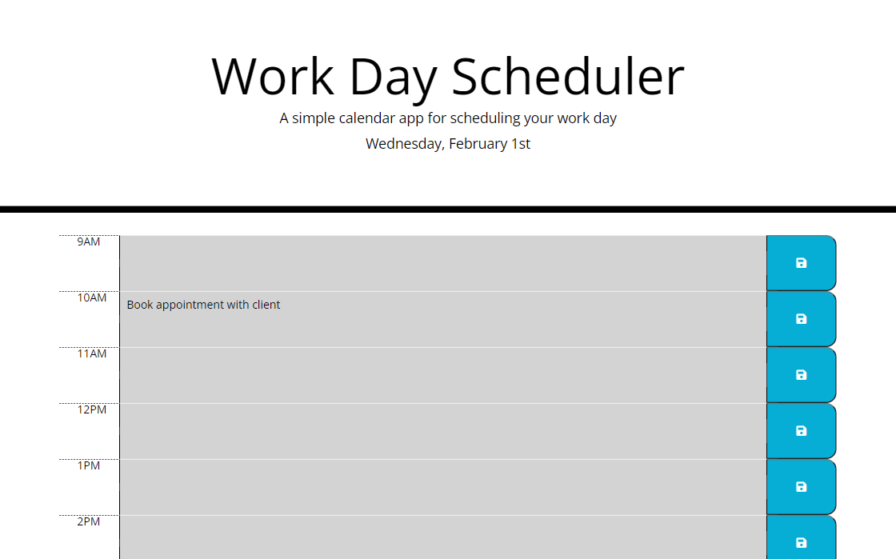
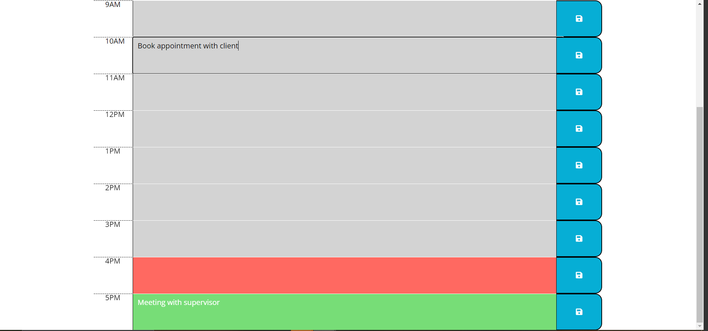

# Daily-Planner-App

## Description

JavaScript application to help users organise their prioritises for the day effectively and quickly.

* When user enters the site, the working day is organised in hourly segments
* Hours that have past, the current hour and future hours are coloured grey, red and green respectively
* If the user clicks a save button adjacent to one of the time segments the text inputed in the text area will be saved to local storage - persisting on the site until it is updated and resaved

## Installation

N/a

## Usage

[Access the Daily Planner Application application](https://rbenameur.github.io/Daily-Planner-App "Link to deployed github page")

Click in the text area of one of the hourly segments to begin editing the tasks to do during that time. Click the save icon adjacent to the hour you are editing to save the task to local storage.

## Credits

N/a

## License

Please refer to the LICENSE in the repo.